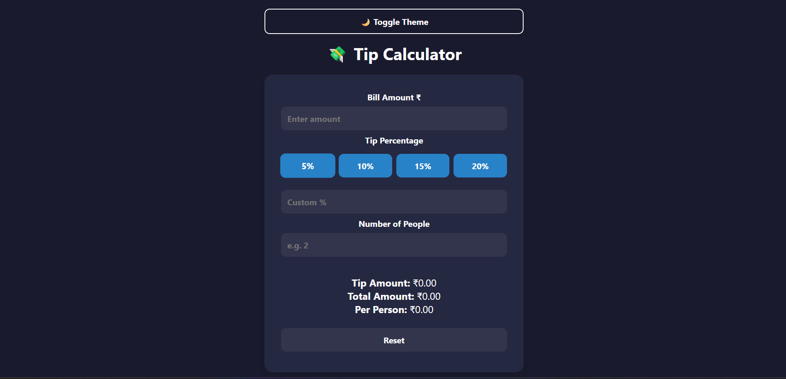

# 💸 Tip Calculator

A stylish, animated, and fully responsive **Tip Calculator** built using **HTML**, **CSS**, and **Vanilla JavaScript** — no frameworks, just pure frontend magic.

---



---

## ✨ Features

- ✅ Calculate Tip, Total, and Per Person Amount
- 👥 Split Bill Between People
- 🌗 Toggle Light/Dark Theme
- 🔁 Reset Button to Clear Inputs
- 🧠 Real-time Input Handling with DOM
- 📱 100% Mobile Responsive Design
- 🎨 Smooth UI Animations & Transitions

---

## 🚀 Live Demo

👉 [Click here to try it out](https://devforgeindia.github.io/tip-calculator/)  
👉 [Watch the YouTube Tutorial](https://youtu.be/zODxFTRRArI)

---

## 📁 Project Structure
```
📦 tip-calculator/
├── index.html
├── style.css
└── script.js
```

---

## 🧠 Concepts Covered

- DOM Manipulation
- Event Listeners
- Form Input Handling
- JavaScript Math Logic
- CSS Animations & Transitions
- Theme Toggling (Dark/Light)
- Mobile Responsive Layout

---

## 🛠️ Installation

```bash
git clone https://github.com/DevForgeIndia/tip-calculator.git
cd tip-calculator
open index.html
```

---

## 💡 Bonus Challenge

Try adding:

- 📊 Tip slider for smoother control
- 📉 Tip breakdown summary
- 💾 Save your last bill using localStorage
- 🔔 Add a sound or animation when calculation is complete

---

## 🙌 Support

If you like this project, please ⭐ star the repo and subscribe on YouTube — it really helps me keep creating!

---

## 📬 Connect With Me
Made with 💖 by [DevForge India](https://www.youtube.com/@DevForge-India/)
